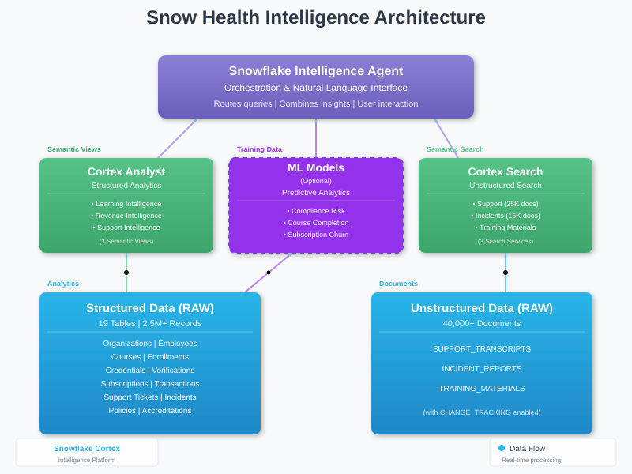

author: Snowflake Labs
id: snow_health_compliance_agent
summary: Build a healthcare compliance intelligence agent using Snowflake Cortex Intelligence, Cortex Analyst, and Cortex Search for training, credentialing, and compliance analytics.
categories: AI & ML, Data Engineering, Healthcare
environments: web
status: Published 
feedback link: https://github.com/Snowflake-Labs/sfguides/issues
tags: Cortex Intelligence, Cortex Analyst, Cortex Search, Semantic Views, Healthcare Compliance, Machine Learning

# Snow Health Compliance Intelligence Agent
<!-- ------------------------ -->
## Overview 

This QuickStart demonstrates how to build a comprehensive healthcare compliance intelligence solution using Snowflake Cortex Intelligence. You'll create an AI agent that analyzes training compliance, credentialing, and healthcare operations using both structured data (via Cortex Analyst) and unstructured data (via Cortex Search).

Snow Health provides healthcare compliance software solutions including learning management systems, credentialing services, and compliance management tools. This solution showcases how AI agents can help healthcare organizations track training compliance, monitor credential expirations, analyze incident patterns, and search unstructured support documentation.

### GitHub Repository

**🔗 Complete Source Code**: [Snow-Health-Compliance on GitHub](https://github.com/sfc-gh-sdickson/Snow-Health-Compliance)

All SQL scripts, notebooks, and documentation for this QuickStart are available in the GitHub repository. You can clone the repository or download individual files as needed throughout this guide.

### Prerequisites
- A Snowflake account with Cortex Intelligence enabled
- ACCOUNTADMIN role or equivalent privileges
- Basic familiarity with SQL and Snowflake
- Understanding of healthcare compliance concepts (helpful but not required)

### What You'll Learn 
- How to create semantic views for Cortex Analyst
- How to build Cortex Search services for unstructured data
- How to configure Snowflake Intelligence Agents
- How to combine structured and unstructured data analytics
- Best practices for healthcare compliance tracking

### What You'll Need 
- Snowflake account with:
  - Cortex Intelligence (Cortex) enabled
  - X-SMALL or larger warehouse
  - CREATE DATABASE, SCHEMA, and TABLE privileges
  - CREATE SEMANTIC VIEW privilege
  - CREATE CORTEX SEARCH SERVICE privilege

### What You'll Build 
- A complete healthcare compliance database with 2.5M+ records
- Three semantic views for AI-powered structured data analysis
- Three Cortex Search services for unstructured data insights
- A Snowflake Intelligence Agent that answers complex healthcare questions
- Optional: ML models for compliance risk prediction


<!-- ------------------------ -->
## Architecture Overview

The Snow Health Intelligence solution combines multiple Snowflake technologies in a three-layer architecture:



### Architecture Layers

**Layer 1: AI Agent (Orchestration)**
- **Snowflake Intelligence Agent**: Routes natural language queries to appropriate services
- Combines insights from both structured and unstructured data sources
- Provides conversational interface for end users

**Layer 2A: Cortex Analyst (Structured Data)**
- Analyzes structured data through 3 semantic views:
  - Learning & Credentialing Intelligence
  - Subscription & Revenue Intelligence
  - Support Intelligence
- Generates SQL queries automatically from natural language
- Provides metrics, aggregations, and trend analysis

**Layer 2B: ML Models (Optional - Predictive Analytics)**
- Three trained machine learning models:
  - Compliance Risk Predictor (Random Forest)
  - Course Completion Predictor (Logistic Regression)
  - Subscription Churn Predictor (Random Forest)
- Consumes structured data from tables
- Provides predictive insights to the Intelligence Agent
- Optional component for advanced analytics

**Layer 2C: Cortex Search (Unstructured Data)**
- Semantic search across 3 document collections:
  - Support Transcripts (25,000 documents)
  - Incident Reports (15,000 documents)
  - Training Materials
- Enables RAG (Retrieval Augmented Generation)
- Finds relevant content by meaning, not just keywords

**Layer 3: Data Sources**
- **Structured**: 19 tables with 2.5M+ records (organizations, employees, courses, credentials, subscriptions, transactions, support tickets, incidents)
- **Unstructured**: 40,000+ documents with change tracking enabled

### Data Flow

1. **Structured Analytics path**: Raw tables → Cortex Analyst (Semantic Views) → Intelligence Agent
2. **Predictive Analytics path** (Optional): Raw tables → ML Models → Intelligence Agent
3. **Unstructured Search path**: Document collections → Cortex Search → Intelligence Agent
4. **Combined insights**: Agent orchestrates between all sources for comprehensive answers

The animated diagram above shows real-time data flows with:
- **Solid arrows**: Core data flows (Cortex Analyst and Cortex Search)
- **Dashed arrows**: Optional ML model flows
- **Color coding**: Green (structured), Purple (ML/Agent), Blue (unstructured)

> aside positive
> 
> **Hybrid Data Architecture**: This solution demonstrates how to combine structured tables with unstructured text data for comprehensive analytics using Cortex Intelligence.


<!-- ------------------------ -->
## Setup Database and Schema

Let's start by creating the database, schemas, and warehouse for our solution.

**Step 1:** Open Snowsight and create a new SQL Worksheet.

**Step 2:** Execute the following SQL to set up your environment:

```sql
-- Create the database
CREATE DATABASE IF NOT EXISTS SNOW_HEALTH_INTELLIGENCE;

-- Use the database
USE DATABASE SNOW_HEALTH_INTELLIGENCE;

-- Create schemas
CREATE SCHEMA IF NOT EXISTS RAW;
CREATE SCHEMA IF NOT EXISTS ANALYTICS;

-- Create a virtual warehouse for query processing
CREATE OR REPLACE WAREHOUSE SNOW_HEALTH_WH WITH
    WAREHOUSE_SIZE = 'X-SMALL'
    AUTO_SUSPEND = 300
    AUTO_RESUME = TRUE
    INITIALLY_SUSPENDED = TRUE
    COMMENT = 'Warehouse for Snow Health Intelligence Agent queries';

-- Set the warehouse as active
USE WAREHOUSE SNOW_HEALTH_WH;

-- Display confirmation
SELECT 'Database, schema, and warehouse setup completed successfully' AS STATUS;
```

**Step 3:** Verify the database and schemas were created:

```sql
SHOW SCHEMAS IN DATABASE SNOW_HEALTH_INTELLIGENCE;
```

You should see `RAW` and `ANALYTICS` schemas.

> aside positive
> 
> **Execution Time**: This step takes less than 1 second to complete.


<!-- ------------------------ -->
## Create Tables

Now we'll create 19 tables that model Snow Health's business operations.

> aside negative
> 
> **Note**: The SQL below shows **example table structures only**. For the complete script with all 19 tables, download the file from GitHub and execute it end-to-end.

**Example - Sample Table Structures (3 of 19 tables):**

```sql
-- EXAMPLE ONLY - Download complete script from GitHub
USE DATABASE SNOW_HEALTH_INTELLIGENCE;
USE SCHEMA RAW;
USE WAREHOUSE SNOW_HEALTH_WH;

-- Organizations Table (Example 1 of 19)
CREATE OR REPLACE TABLE ORGANIZATIONS (
    organization_id VARCHAR(20) PRIMARY KEY,
    organization_name VARCHAR(200) NOT NULL,
    contact_email VARCHAR(200) NOT NULL,
    contact_phone VARCHAR(20),
    country VARCHAR(50) DEFAULT 'USA',
    state VARCHAR(50),
    city VARCHAR(100),
    signup_date DATE NOT NULL,
    organization_status VARCHAR(20) DEFAULT 'ACTIVE',
    organization_type VARCHAR(30),
    lifetime_value NUMBER(12,2) DEFAULT 0.00,
    compliance_risk_score NUMBER(5,2),
    total_employees NUMBER(10,0) DEFAULT 0,
    created_at TIMESTAMP_NTZ DEFAULT CURRENT_TIMESTAMP(),
    updated_at TIMESTAMP_NTZ DEFAULT CURRENT_TIMESTAMP()
);

-- Employees Table (Example 2 of 19)
CREATE OR REPLACE TABLE EMPLOYEES (
    employee_id VARCHAR(30) PRIMARY KEY,
    organization_id VARCHAR(20) NOT NULL,
    employee_name VARCHAR(200) NOT NULL,
    email VARCHAR(200) NOT NULL,
    job_title VARCHAR(100),
    department VARCHAR(100),
    hire_date DATE,
    employee_status VARCHAR(20) DEFAULT 'ACTIVE',
    requires_credentialing BOOLEAN DEFAULT FALSE,
    compliance_status VARCHAR(30) DEFAULT 'COMPLIANT',
    last_training_date DATE,
    created_at TIMESTAMP_NTZ DEFAULT CURRENT_TIMESTAMP(),
    updated_at TIMESTAMP_NTZ DEFAULT CURRENT_TIMESTAMP(),
    FOREIGN KEY (organization_id) REFERENCES ORGANIZATIONS(organization_id)
);

-- Courses Table (Example 3 of 19)
CREATE OR REPLACE TABLE COURSES (
    course_id VARCHAR(30) PRIMARY KEY,
    course_name VARCHAR(200) NOT NULL,
    course_category VARCHAR(50) NOT NULL,
    course_type VARCHAR(50),
    duration_minutes NUMBER(10,0),
    required_score NUMBER(5,2),
    renewal_frequency_days NUMBER(10,0),
    course_description VARCHAR(1000),
    accreditation_body VARCHAR(100),
    credits_awarded NUMBER(5,2),
    is_active BOOLEAN DEFAULT TRUE,
    created_at TIMESTAMP_NTZ DEFAULT CURRENT_TIMESTAMP(),
    updated_at TIMESTAMP_NTZ DEFAULT CURRENT_TIMESTAMP()
);

-- ... 16 more tables (see complete file) ...
```

**Download and Execute Complete Table Creation Script:**

**📄 View on GitHub**: [02_create_tables.sql](https://github.com/sfc-gh-sdickson/Snow-Health-Compliance/blob/main/sql/setup/02_create_tables.sql)  
**⬇️ Download**: [Download Table Creation SQL](https://raw.githubusercontent.com/sfc-gh-sdickson/Snow-Health-Compliance/main/sql/setup/02_create_tables.sql)

The complete script creates all 19 tables including:
- ORGANIZATIONS, EMPLOYEES, COURSES
- COURSE_ENROLLMENTS, COURSE_COMPLETIONS
- CREDENTIALS, CREDENTIAL_VERIFICATIONS, EXCLUSIONS_MONITORING
- SUBSCRIPTIONS, TRANSACTIONS
- SUPPORT_TICKETS, SUPPORT_AGENTS
- INCIDENTS, POLICIES, POLICY_ACKNOWLEDGMENTS, ACCREDITATIONS
- PRODUCTS, MARKETING_CAMPAIGNS

**Execute the complete script end-to-end in your SQL Worksheet.**

**Verify tables were created:

```sql
SHOW TABLES IN SCHEMA RAW;
```

You should see 19 tables.

> aside positive
> 
> **Execution Time**: This step takes less than 5 seconds to complete.


<!-- ------------------------ -->
## Generate Synthetic Data

Now we'll populate the tables with realistic healthcare data.

> aside negative
> 
> **Note**: The SQL below shows an **example for one table only**. The complete script generates data for all 19 tables with proper relationships. Download and execute the complete file end-to-end.

This creates:
- 50,000 healthcare organizations (hospitals, clinics, practices)
- 500,000 employees across all organizations
- 1,000,000 course enrollments
- 750,000 course completions
- 100,000 provider credentials
- 1,500,000 financial transactions
- 75,000 support tickets
- 50,000 incident reports
- And more...

**Example - Organizations Table Data Generation (1 of 19 tables):**

```sql
-- EXAMPLE ONLY - Download complete script from GitHub
USE DATABASE SNOW_HEALTH_INTELLIGENCE;
USE SCHEMA RAW;
USE WAREHOUSE SNOW_HEALTH_WH;

-- Generate Organizations (50,000 records)
INSERT INTO ORGANIZATIONS
SELECT
    'ORG-' || LPAD(SEQ4(), 5, '0') AS organization_id,
    CASE 
        WHEN UNIFORM(1, 3, RANDOM()) = 1 THEN 'HOSPITAL'
        WHEN UNIFORM(1, 3, RANDOM()) = 2 THEN 'CLINIC'
        ELSE 'PRACTICE'
    END || ' - ' || SEQ4() AS organization_name,
    'contact' || SEQ4() || '@healthcare.com' AS contact_email,
    '+1-555-' || LPAD(UNIFORM(1000000, 9999999, RANDOM()), 7, '0') AS contact_phone,
    'USA' AS country,
    CASE UNIFORM(1, 10, RANDOM())
        WHEN 1 THEN 'CA' WHEN 2 THEN 'TX' WHEN 3 THEN 'NY'
        WHEN 4 THEN 'FL' WHEN 5 THEN 'IL' WHEN 6 THEN 'PA'
        WHEN 7 THEN 'OH' WHEN 8 THEN 'GA' WHEN 9 THEN 'NC'
        ELSE 'MI'
    END AS state,
    'City-' || SEQ4() AS city,
    DATEADD(day, -UNIFORM(1, 1825, RANDOM()), CURRENT_DATE()) AS signup_date,
    CASE UNIFORM(1, 100, RANDOM())
        WHEN 1 THEN 'SUSPENDED'
        WHEN 2 THEN 'CLOSED'
        ELSE 'ACTIVE'
    END AS organization_status,
    CASE 
        WHEN UNIFORM(1, 3, RANDOM()) = 1 THEN 'HOSPITAL'
        WHEN UNIFORM(1, 3, RANDOM()) = 2 THEN 'CLINIC'
        ELSE 'PRACTICE'
    END AS organization_type,
    UNIFORM(5000, 500000, RANDOM()) AS lifetime_value,
    UNIFORM(0, 100, RANDOM()) / 10.0 AS compliance_risk_score,
    UNIFORM(5, 500, RANDOM()) AS total_employees,
    CURRENT_TIMESTAMP() AS created_at,
    CURRENT_TIMESTAMP() AS updated_at
FROM TABLE(GENERATOR(ROWCOUNT => 50000));

-- ... INSERT statements for 18 more tables (see complete file) ...
```

**Download and Execute Complete Data Generation Script:**

**📄 View on GitHub**: [03_generate_synthetic_data.sql](https://github.com/sfc-gh-sdickson/Snow-Health-Compliance/blob/main/sql/data/03_generate_synthetic_data.sql)  
**⬇️ Download**: [Download Data Generation SQL](https://raw.githubusercontent.com/sfc-gh-sdickson/Snow-Health-Compliance/main/sql/data/03_generate_synthetic_data.sql)

**Execute the complete script end-to-end in your SQL Worksheet.**

**Verify data was loaded:

```sql
SELECT 
    'ORGANIZATIONS' AS table_name, COUNT(*) AS record_count FROM ORGANIZATIONS
UNION ALL
SELECT 'EMPLOYEES', COUNT(*) FROM EMPLOYEES
UNION ALL
SELECT 'COURSES', COUNT(*) FROM COURSES
UNION ALL
SELECT 'COURSE_ENROLLMENTS', COUNT(*) FROM COURSE_ENROLLMENTS
UNION ALL
SELECT 'COURSE_COMPLETIONS', COUNT(*) FROM COURSE_COMPLETIONS
UNION ALL
SELECT 'CREDENTIALS', COUNT(*) FROM CREDENTIALS
UNION ALL
SELECT 'SUBSCRIPTIONS', COUNT(*) FROM SUBSCRIPTIONS
UNION ALL
SELECT 'TRANSACTIONS', COUNT(*) FROM TRANSACTIONS
UNION ALL
SELECT 'SUPPORT_TICKETS', COUNT(*) FROM SUPPORT_TICKETS
UNION ALL
SELECT 'INCIDENTS', COUNT(*) FROM INCIDENTS;
```

> aside negative
> 
> **Execution Time**: This step takes 10-20 minutes depending on warehouse size. Consider using SMALL or MEDIUM warehouse to speed up data generation.


<!-- ------------------------ -->
## Create Analytical Views

Create curated analytical views that aggregate and summarize the data.

> aside negative
> 
> **Note**: The SQL below shows **examples of 2 views only**. The complete script creates 8 analytical views. Download and execute the complete file end-to-end.

**Example - Sample Analytical Views (2 of 8 views):**

```sql
-- EXAMPLE ONLY - Download complete script from GitHub
USE DATABASE SNOW_HEALTH_INTELLIGENCE;
USE SCHEMA ANALYTICS;
USE WAREHOUSE SNOW_HEALTH_WH;

-- Organization 360 View (Example 1 of 8)
CREATE OR REPLACE VIEW V_ORGANIZATION_360 AS
SELECT
    o.organization_id,
    o.organization_name,
    o.organization_type,
    o.organization_status,
    o.state,
    o.city,
    o.signup_date,
    o.lifetime_value,
    o.compliance_risk_score,
    COUNT(DISTINCT e.employee_id) AS total_employees,
    COUNT(DISTINCT s.subscription_id) AS active_subscriptions,
    COUNT(DISTINCT st.ticket_id) AS total_support_tickets,
    COUNT(DISTINCT i.incident_id) AS total_incidents
FROM RAW.ORGANIZATIONS o
LEFT JOIN RAW.EMPLOYEES e ON o.organization_id = e.organization_id
LEFT JOIN RAW.SUBSCRIPTIONS s ON o.organization_id = s.organization_id AND s.subscription_status = 'ACTIVE'
LEFT JOIN RAW.SUPPORT_TICKETS st ON o.organization_id = st.organization_id
LEFT JOIN RAW.INCIDENTS i ON o.organization_id = i.organization_id
GROUP BY 
    o.organization_id, o.organization_name, o.organization_type, 
    o.organization_status, o.state, o.city, o.signup_date, 
    o.lifetime_value, o.compliance_risk_score;

-- Employee Training Analytics View (Example 2 of 8)
CREATE OR REPLACE VIEW V_EMPLOYEE_TRAINING_ANALYTICS AS
SELECT
    e.employee_id,
    e.employee_name,
    e.organization_id,
    e.job_title,
    e.department,
    e.employee_status,
    e.compliance_status,
    COUNT(DISTINCT ce.enrollment_id) AS total_enrollments,
    COUNT(DISTINCT cc.completion_id) AS total_completions,
    COUNT(DISTINCT CASE WHEN ce.is_mandatory = TRUE AND cc.completion_id IS NULL 
        THEN ce.enrollment_id END) AS overdue_mandatory_courses,
    MAX(cc.completion_date) AS last_completion_date,
    AVG(cc.score) AS average_score
FROM RAW.EMPLOYEES e
LEFT JOIN RAW.COURSE_ENROLLMENTS ce ON e.employee_id = ce.employee_id
LEFT JOIN RAW.COURSE_COMPLETIONS cc ON ce.enrollment_id = cc.enrollment_id
GROUP BY 
    e.employee_id, e.employee_name, e.organization_id, 
    e.job_title, e.department, e.employee_status, e.compliance_status;

-- ... 6 more views (see complete file) ...
```

**Download and Execute Complete Analytical Views Script:**

**📄 View on GitHub**: [04_create_views.sql](https://github.com/sfc-gh-sdickson/Snow-Health-Compliance/blob/main/sql/views/04_create_views.sql)  
**⬇️ Download**: [Download Analytical Views SQL](https://raw.githubusercontent.com/sfc-gh-sdickson/Snow-Health-Compliance/main/sql/views/04_create_views.sql)

The complete script creates 8 analytical views:
- V_ORGANIZATION_360
- V_EMPLOYEE_TRAINING_ANALYTICS
- V_CREDENTIAL_COMPLIANCE_ANALYTICS
- V_SUBSCRIPTION_ANALYTICS
- V_REVENUE_ANALYTICS
- V_SUPPORT_ANALYTICS
- V_CAMPAIGN_PERFORMANCE
- V_INCIDENT_ANALYTICS

**Execute the complete script end-to-end in your SQL Worksheet.**

> aside positive
> 
> **Execution Time**: This step takes less than 10 seconds to complete.


<!-- ------------------------ -->
## Create Semantic Views

Semantic views are the foundation for Cortex Analyst. They define the business logic, relationships, dimensions, and metrics that the AI agent will use to answer questions.

> aside negative
> 
> **Note**: The SQL below shows **one complete semantic view as an example**. The complete script creates 3 semantic views. Download and execute the complete file end-to-end.

**Example - Learning & Credentialing Intelligence Semantic View (1 of 3):**

```sql
-- EXAMPLE ONLY - Download complete script from GitHub
USE DATABASE SNOW_HEALTH_INTELLIGENCE;
USE SCHEMA ANALYTICS;
USE WAREHOUSE SNOW_HEALTH_WH;

-- Semantic View 1: Learning & Credentialing Intelligence (Example 1 of 3)
CREATE OR REPLACE SEMANTIC VIEW SV_LEARNING_CREDENTIALING_INTELLIGENCE
  TABLES (
    organizations AS RAW.ORGANIZATIONS
      PRIMARY KEY (organization_id)
      WITH SYNONYMS ('healthcare organizations', 'training clients', 'learning customers')
      COMMENT = 'Healthcare organizations using Snow Health',
    employees AS RAW.EMPLOYEES
      PRIMARY KEY (employee_id)
      WITH SYNONYMS ('staff', 'providers', 'personnel')
      COMMENT = 'Employees within healthcare organizations',
    courses AS RAW.COURSES
      PRIMARY KEY (course_id)
      WITH SYNONYMS ('training courses', 'classes', 'programs')
      COMMENT = 'Training courses available',
    completions AS RAW.COURSE_COMPLETIONS
      PRIMARY KEY (completion_id)
      WITH SYNONYMS ('course completions', 'training completions', 'certificates')
      COMMENT = 'Completed training courses',
    credentials AS RAW.CREDENTIALS
      PRIMARY KEY (credential_id)
      WITH SYNONYMS ('licenses', 'certifications', 'provider credentials')
      COMMENT = 'Provider credentials and licenses'
  )
  RELATIONSHIPS (
    employees(organization_id) REFERENCES organizations(organization_id),
    completions(employee_id) REFERENCES employees(employee_id),
    completions(course_id) REFERENCES courses(course_id),
    credentials(employee_id) REFERENCES employees(employee_id),
    credentials(organization_id) REFERENCES organizations(organization_id)
  )
  DIMENSIONS (
    organizations.organization_name AS organization_name
      WITH SYNONYMS ('org name', 'healthcare facility name')
      COMMENT = 'Name of the healthcare organization',
    organizations.organization_type AS organization_type
      WITH SYNONYMS ('org type', 'healthcare facility type')
      COMMENT = 'Organization type: HOSPITAL, CLINIC, PRACTICE',
    employees.employee_name AS employee_name
      WITH SYNONYMS ('staff name', 'provider name')
      COMMENT = 'Name of the employee',
    employees.job_title AS job_title
      WITH SYNONYMS ('position', 'role', 'title')
      COMMENT = 'Employee job title',
    courses.course_name AS course_name
      WITH SYNONYMS ('training name', 'class name')
      COMMENT = 'Name of the training course',
    credentials.credential_type AS credential_type
      WITH SYNONYMS ('license type', 'certification type')
      COMMENT = 'Type of credential: MEDICAL_LICENSE, DEA, NPI, etc.'
  )
  METRICS (
    total_employees AS COUNT(DISTINCT employees.employee_id)
      WITH SYNONYMS ('employee count', 'number of staff')
      COMMENT = 'Total number of employees',
    total_course_completions AS COUNT(DISTINCT completions.completion_id)
      WITH SYNONYMS ('completed courses', 'training completions')
      COMMENT = 'Total number of completed training courses',
    avg_course_score AS AVG(completions.score)
      WITH SYNONYMS ('average training score', 'mean score')
      COMMENT = 'Average score across all course completions',
    total_credentials AS COUNT(DISTINCT credentials.credential_id)
      WITH SYNONYMS ('credential count', 'license count')
      COMMENT = 'Total number of credentials tracked'
  )
  COMMENT = 'Comprehensive view of training compliance, course completions, and credentialing';
```

**Key Semantic View Concepts:**

- **TABLES**: Define source tables with primary keys and synonyms
- **RELATIONSHIPS**: Define foreign key relationships between tables
- **DIMENSIONS**: Define descriptive attributes with synonyms for natural language queries
- **METRICS**: Define calculations and aggregations the agent can use

**Download and Execute Complete Semantic Views Script:**

**📄 View on GitHub**: [05_create_semantic_views.sql](https://github.com/sfc-gh-sdickson/Snow-Health-Compliance/blob/main/sql/views/05_create_semantic_views.sql)  
**⬇️ Download**: [Download Semantic Views SQL](https://raw.githubusercontent.com/sfc-gh-sdickson/Snow-Health-Compliance/main/sql/views/05_create_semantic_views.sql)

The complete script creates 3 semantic views:
- **SV_LEARNING_CREDENTIALING_INTELLIGENCE**: Training and credential analytics
- **SV_SUBSCRIPTION_REVENUE_INTELLIGENCE**: Subscription and revenue metrics
- **SV_ORGANIZATION_SUPPORT_INTELLIGENCE**: Support ticket and agent performance

**Execute the complete script end-to-end in your SQL Worksheet.**

**Verify semantic views were created:

```sql
SHOW SEMANTIC VIEWS IN SCHEMA ANALYTICS;
```

> aside positive
> 
> **Syntax Verified**: All semantic view syntax has been verified against [official Snowflake documentation](https://docs.snowflake.com/en/sql-reference/sql/create-semantic-view).


<!-- ------------------------ -->
## Create Cortex Search Services

Cortex Search enables semantic search over unstructured text data. We'll create three search services for support transcripts, incident reports, and training materials.

> aside negative
> 
> **Note**: The complete script includes table creation, data population (40,000+ documents), and search service creation. Download and execute the complete file end-to-end for best results.

**Step 1: Create Tables for Unstructured Data**

Execute this SQL to create the three tables with change tracking enabled:

```sql
USE DATABASE SNOW_HEALTH_INTELLIGENCE;
USE SCHEMA RAW;
USE WAREHOUSE SNOW_HEALTH_WH;

-- Support Transcripts Table (for semantic search)
CREATE OR REPLACE TABLE SUPPORT_TRANSCRIPTS (
    transcript_id VARCHAR(30) PRIMARY KEY,
    ticket_id VARCHAR(30),
    organization_id VARCHAR(20),
    interaction_type VARCHAR(50),
    channel VARCHAR(30),
    interaction_date TIMESTAMP_NTZ,
    transcript_text TEXT,
    issue_resolved BOOLEAN,
    created_at TIMESTAMP_NTZ DEFAULT CURRENT_TIMESTAMP()
) CHANGE_TRACKING = TRUE;

-- Incident Reports Table (for semantic search)
CREATE OR REPLACE TABLE INCIDENT_REPORTS (
    report_id VARCHAR(30) PRIMARY KEY,
    incident_id VARCHAR(30),
    organization_id VARCHAR(20),
    report_date TIMESTAMP_NTZ,
    report_text TEXT,
    investigation_status VARCHAR(50),
    created_at TIMESTAMP_NTZ DEFAULT CURRENT_TIMESTAMP()
) CHANGE_TRACKING = TRUE;

-- Training Materials Table (for semantic search)
CREATE OR REPLACE TABLE TRAINING_MATERIALS (
    material_id VARCHAR(30) PRIMARY KEY,
    title VARCHAR(500),
    category VARCHAR(100),
    content TEXT,
    document_type VARCHAR(50),
    created_at TIMESTAMP_NTZ DEFAULT CURRENT_TIMESTAMP()
) CHANGE_TRACKING = TRUE;
```

> aside negative
> 
> **Important**: `CHANGE_TRACKING = TRUE` is required for Cortex Search services to function properly.

**Step 2: Download Complete Script to Populate Data and Create Search Services**

The complete script populates tables with sample unstructured data (25,000 support transcripts, 15,000 incident reports, and 3 training materials) and creates the Cortex Search services.

**📄 View on GitHub**: [06_create_cortex_search.sql](https://github.com/sfc-gh-sdickson/Snow-Health-Compliance/blob/main/sql/search/06_create_cortex_search.sql)  
**⬇️ Download**: [Download Cortex Search SQL](https://raw.githubusercontent.com/sfc-gh-sdickson/Snow-Health-Compliance/main/sql/search/06_create_cortex_search.sql)

**Execute the complete script end-to-end in your SQL Worksheet.**

**Example - Cortex Search Service Definitions (from complete script):**

```sql
-- Cortex Search Service 1: Support Transcripts
CREATE OR REPLACE CORTEX SEARCH SERVICE SUPPORT_TRANSCRIPTS_SEARCH
    ON transcript_text
    ATTRIBUTES ticket_id, organization_id, interaction_type, channel, interaction_date
    WAREHOUSE = SNOW_HEALTH_WH
    TARGET_LAG = '1 minute'
    AS (
        SELECT 
            transcript_id,
            transcript_text,
            ticket_id,
            organization_id,
            interaction_type,
            channel,
            interaction_date
        FROM SUPPORT_TRANSCRIPTS
    );

-- Cortex Search Service 2: Incident Reports
CREATE OR REPLACE CORTEX SEARCH SERVICE INCIDENT_REPORTS_SEARCH
    ON report_text
    ATTRIBUTES incident_id, organization_id, report_date, investigation_status
    WAREHOUSE = SNOW_HEALTH_WH
    TARGET_LAG = '1 minute'
    AS (
        SELECT 
            report_id,
            report_text,
            incident_id,
            organization_id,
            report_date,
            investigation_status
        FROM INCIDENT_REPORTS
    );

-- Cortex Search Service 3: Training Materials
CREATE OR REPLACE CORTEX SEARCH SERVICE TRAINING_MATERIALS_SEARCH
    ON content
    ATTRIBUTES title, category, document_type
    WAREHOUSE = SNOW_HEALTH_WH
    TARGET_LAG = '1 minute'
    AS (
        SELECT 
            material_id,
            content,
            title,
            category,
            document_type
        FROM TRAINING_MATERIALS
    );
```

**Step 3:** Wait for the search services to index (3-5 minutes). Verify they're ready:

```sql
SHOW CORTEX SEARCH SERVICES IN SCHEMA RAW;
```

**Step 4:** Test a search service:

```sql
SELECT PARSE_JSON(
  SNOWFLAKE.CORTEX.SEARCH_PREVIEW(
      'SNOW_HEALTH_INTELLIGENCE.RAW.SUPPORT_TRANSCRIPTS_SEARCH',
      '{"query": "credential verification help", "limit":5}'
  )
)['results'] as results;
```

> aside positive
> 
> **Execution Time**: Table creation is instant. Data generation and search service indexing takes 5-10 minutes total.


<!-- ------------------------ -->
## Configure Intelligence Agent

Now we'll create and configure the Snowflake Intelligence Agent to orchestrate between structured and unstructured data sources.

**Step 1: Grant Permissions**

```sql
USE ROLE ACCOUNTADMIN;

-- Grant Cortex Analyst user role
GRANT DATABASE ROLE SNOWFLAKE.CORTEX_ANALYST_USER TO ROLE <your_role>;

-- Grant usage on database and schemas
GRANT USAGE ON DATABASE SNOW_HEALTH_INTELLIGENCE TO ROLE <your_role>;
GRANT USAGE ON SCHEMA SNOW_HEALTH_INTELLIGENCE.ANALYTICS TO ROLE <your_role>;
GRANT USAGE ON SCHEMA SNOW_HEALTH_INTELLIGENCE.RAW TO ROLE <your_role>;

-- Grant privileges on semantic views
GRANT REFERENCES, SELECT ON SEMANTIC VIEW SNOW_HEALTH_INTELLIGENCE.ANALYTICS.SV_LEARNING_CREDENTIALING_INTELLIGENCE TO ROLE <your_role>;
GRANT REFERENCES, SELECT ON SEMANTIC VIEW SNOW_HEALTH_INTELLIGENCE.ANALYTICS.SV_SUBSCRIPTION_REVENUE_INTELLIGENCE TO ROLE <your_role>;
GRANT REFERENCES, SELECT ON SEMANTIC VIEW SNOW_HEALTH_INTELLIGENCE.ANALYTICS.SV_ORGANIZATION_SUPPORT_INTELLIGENCE TO ROLE <your_role>;

-- Grant usage on warehouse
GRANT USAGE ON WAREHOUSE SNOW_HEALTH_WH TO ROLE <your_role>;

-- Grant usage on Cortex Search services
GRANT USAGE ON CORTEX SEARCH SERVICE SNOW_HEALTH_INTELLIGENCE.RAW.SUPPORT_TRANSCRIPTS_SEARCH TO ROLE <your_role>;
GRANT USAGE ON CORTEX SEARCH SERVICE SNOW_HEALTH_INTELLIGENCE.RAW.INCIDENT_REPORTS_SEARCH TO ROLE <your_role>;
GRANT USAGE ON CORTEX SEARCH SERVICE SNOW_HEALTH_INTELLIGENCE.RAW.TRAINING_MATERIALS_SEARCH TO ROLE <your_role>;
```

**Step 2: Create the Agent**

1. In Snowsight, navigate to **AI & ML** → **Agents**
2. Click **+ Agent** (or **Create Agent**)
3. Select **Create this agent for Snowflake Intelligence**
4. Configure:
   - **Agent Object Name**: `SNOW_HEALTH_INTELLIGENCE_AGENT`
   - **Display Name**: `Snow Health Intelligence Agent`
5. Click **Create**

**Step 3: Add Description and Instructions**

1. Click **Edit** on the agent
2. In the **Description** section, add:
   ```
   This agent orchestrates between Snow Health training, credentialing, and compliance data 
   for analyzing structured metrics using Cortex Analyst (semantic views) and unstructured 
   content using Cortex Search services (support transcripts, incident reports, training materials).
   ```

3. In **Response Instructions**, add:
   ```
   You are a specialized analytics assistant for Snow Health, a healthcare compliance and 
   training platform. Your primary objectives are:

   For structured data queries (metrics, KPIs, compliance figures):
   - Use the Cortex Analyst semantic views for training compliance, credentialing, subscriptions, 
     and revenue analysis
   - Provide direct, numerical answers with minimal explanation
   - Format responses clearly with relevant units and time periods

   For unstructured content (support transcripts, incident reports, training materials):
   - Use Cortex Search services to find similar cases, procedures, and documentation
   - Extract relevant information from past interactions and reports
   - Summarize findings in brief, focused responses

   Operating guidelines:
   - Keep responses under 3-4 sentences when possible
   - Present numerical data in a structured format
   - Don't speculate beyond available data
   - Highlight compliance risks and credential expirations prominently
   ```

**Step 4: Add Cortex Analyst Tools (Semantic Views)**

In the agent, click **Tools** → **Cortex Analyst** → **+ Add**:

**Add View 1: Learning & Credentialing Intelligence**
- **Name**: `Learning_Credentialing_Intelligence`
- **Type**: Semantic view
- **Database**: `SNOW_HEALTH_INTELLIGENCE.ANALYTICS`
- **View**: `SV_LEARNING_CREDENTIALING_INTELLIGENCE`
- **Warehouse**: `SNOW_HEALTH_WH`
- **Timeout**: `60` seconds
- **Description**: `Analyzes training compliance, course completions, employee credentials, and credentialing verification. Use for questions about employee training status, credential expirations, course effectiveness, and compliance tracking.`

**Add View 2: Subscription & Revenue Intelligence**
- **Name**: `Subscription_Revenue_Intelligence`
- **Type**: Semantic view
- **Database**: `SNOW_HEALTH_INTELLIGENCE.ANALYTICS`
- **View**: `SV_SUBSCRIPTION_REVENUE_INTELLIGENCE`
- **Warehouse**: `SNOW_HEALTH_WH`
- **Timeout**: `60` seconds
- **Description**: `Analyzes subscription health, revenue trends, transaction patterns, and product performance. Use for questions about subscription renewals, revenue analysis, product adoption, and customer lifetime value.`

**Add View 3: Organization Support Intelligence**
- **Name**: `Organization_Support_Intelligence`
- **Type**: Semantic view
- **Database**: `SNOW_HEALTH_INTELLIGENCE.ANALYTICS`
- **View**: `SV_ORGANIZATION_SUPPORT_INTELLIGENCE`
- **Warehouse**: `SNOW_HEALTH_WH`
- **Timeout**: `60` seconds
- **Description**: `Analyzes support ticket resolution, agent performance, and customer satisfaction. Use for questions about support efficiency, ticket trends, agent productivity, and customer satisfaction metrics.`

**Step 5: Add Cortex Search Services**

In the agent, click **Tools** → **Cortex Search Services** → **+ Add**:

**Add Search 1: Support Transcripts Search**
- **Name**: `Support_Transcripts_Search`
- **Description**: `Search 25,000 customer support transcripts to find similar issues, resolution procedures, and support best practices. Use for questions about customer service patterns, technical troubleshooting, feature usage, and common support scenarios.`
- **Database**: `SNOW_HEALTH_INTELLIGENCE.RAW`
- **Service**: `SUPPORT_TRANSCRIPTS_SEARCH`
- **ID Column**: `transcript_id`
- **Title Column**: `transcript_text`

**Add Search 2: Incident Reports Search**
- **Name**: `Incident_Reports_Search`
- **Description**: `Search 15,000 incident investigation reports to find similar incidents, root causes, and effective corrective actions. Use for questions about patient safety, medication errors, HIPAA breaches, workplace injuries, and incident patterns.`
- **Database**: `SNOW_HEALTH_INTELLIGENCE.RAW`
- **Service**: `INCIDENT_REPORTS_SEARCH`
- **ID Column**: `report_id`
- **Title Column**: `report_text`

**Add Search 3: Training Materials Search**
- **Name**: `Training_Materials_Search`
- **Description**: `Search training materials and compliance guides for procedures, protocols, and best practices. Use for questions about HIPAA privacy, infection control, CPR/BLS procedures, and regulatory compliance guidance.`
- **Database**: `SNOW_HEALTH_INTELLIGENCE.RAW`
- **Service**: `TRAINING_MATERIALS_SEARCH`
- **ID Column**: `material_id`
- **Title Column**: `title`

**Step 6: Configure Orchestration**

1. Click **Orchestration** in the left menu
2. **Orchestration model**: Leave as **Auto** (or select `mistral-large2`)
3. In **Planning instructions**, add:
   ```
   If a query spans both structured and unstructured data, clearly separate the sources.
   
   For any query, first determine whether it requires:
   (a) Structured data analysis → Use Cortex Analyst semantic views
   (b) Report content/context → Use Cortex Search
   (c) Both → Combine both services with clear source attribution
   
   For training compliance queries, always check due dates and mandatory status.
   For credential queries, highlight expiration risks.
   For incident queries, search for similar past cases and corrective actions.
   ```

**Step 7: Save and Test**

Click **Save** and proceed to testing!

> aside positive
> 
> **Setup Complete**: Your Snowflake Intelligence Agent is now configured with both structured and unstructured data sources!


<!-- ------------------------ -->
## Test Structured Data Queries

Let's test the agent's ability to answer complex questions using structured data via Cortex Analyst.

**Test Question 1: Training Compliance**

```
How many employees have overdue mandatory training?
```

Expected: The agent uses the `Learning_Credentialing_Intelligence` semantic view to query course enrollments and completions.

**Test Question 2: Credential Expiration**

```
Which providers have credentials expiring in the next 90 days? Breakdown by credential type.
```

Expected: The agent queries credentials with expiration dates and groups by type.

**Test Question 3: Subscription Analysis**

```
What is the total revenue from LEARNING service subscriptions this year?
```

Expected: The agent uses `Subscription_Revenue_Intelligence` to calculate revenue.

**Test Question 4: Support Metrics**

```
What is the average resolution time for support tickets by priority?
```

Expected: The agent uses `Organization_Support_Intelligence` to aggregate ticket data.

**Test Question 5: Complex Multi-Dimensional**

```
Analyze employees with overdue mandatory training. Show me the total count, breakdown by organization type, 
and which job titles have the highest non-compliance rates.
```

Expected: The agent performs multi-table joins and multi-dimensional analysis.

**Verify the Agent's Behavior:**

For each question, review:
1. Which semantic view the agent selected
2. The SQL query generated by Cortex Analyst
3. The accuracy of the results
4. The quality of the natural language response

> aside positive
> 
> **Pro Tip**: Click on the SQL icon in the agent response to see the exact query that was generated!


<!-- ------------------------ -->
## Test Unstructured Data Search

Now let's test semantic search over unstructured data using Cortex Search.

**Test Question 1: Support Issue Discovery**

```
Search support transcripts for issues related to course assignment and bulk enrollment. 
What are the most common problems?
```

Expected: The agent uses `Support_Transcripts_Search` to find relevant conversations.

**Test Question 2: Incident Investigation**

```
Find incident reports about patient falls. What were the common root causes?
```

Expected: The agent uses `Incident_Reports_Search` to retrieve fall-related incidents.

**Test Question 3: Training Content Retrieval**

```
What does our training material say about proper hand hygiene technique?
```

Expected: The agent uses `Training_Materials_Search` to find infection control procedures.

**Test Question 4: Credential Verification Support**

```
Search support transcripts for credential verification issues. What challenges do customers face?
```

Expected: The agent searches support conversations for credentialing topics.

**Test Question 5: Medication Error Analysis**

```
Find all incident reports involving medication errors. What were the contributing factors?
```

Expected: The agent searches incident reports and extracts patterns.

**Test a Direct Cortex Search Query (Optional):**

You can also test Cortex Search directly in SQL:

```sql
SELECT PARSE_JSON(
  SNOWFLAKE.CORTEX.SEARCH_PREVIEW(
      'SNOW_HEALTH_INTELLIGENCE.RAW.INCIDENT_REPORTS_SEARCH',
      '{
        "query": "patient fall prevention",
        "columns":["report_text", "investigation_status"],
        "limit":10
      }'
  )
)['results'] as results;
```

> aside positive
> 
> **Semantic Search**: Unlike keyword search, Cortex Search understands meaning and context, finding relevant results even when exact terms don't match!


<!-- ------------------------ -->
## Optional: Add ML Models

For advanced analytics, you can add ML models to predict compliance risk, course completion likelihood, and subscription churn.

**Step 1: Open Snowflake Notebook**

1. In Snowsight, navigate to **Projects** → **Notebooks**
2. Click **+ Notebook**
3. Name it `Snow Health ML Models`
4. Select the `SNOW_HEALTH_INTELLIGENCE` database and `ANALYTICS` schema
5. Select the `SNOW_HEALTH_WH` warehouse

**Step 2: Add Required Packages**

In the notebook, add these packages:
- `snowflake-ml-python`
- `scikit-learn`
- `xgboost`
- `matplotlib`

**Step 3: Download the ML Notebook**

**📄 View on GitHub**: [snow_health_ml_models.ipynb](https://github.com/sfc-gh-sdickson/Snow-Health-Compliance/blob/main/notebooks/snow_health_ml_models.ipynb)  
**⬇️ Download**: [Download ML Notebook](https://raw.githubusercontent.com/sfc-gh-sdickson/Snow-Health-Compliance/main/notebooks/snow_health_ml_models.ipynb)

**Step 4: Train the Models**

The notebook trains three models:

1. **Compliance Risk Predictor**: Identifies employees at risk of compliance violations (Random Forest)
2. **Course Completion Predictor**: Predicts which enrolled employees will complete training (Logistic Regression)
3. **Subscription Churn Predictor**: Identifies organizations likely to cancel subscriptions (Random Forest)

Run all cells in the notebook to train and register the models to Snowflake Model Registry.

**Step 5: Create Model Wrapper Functions**

Execute the wrapper SQL script:

**📄 View on GitHub**: [07_create_model_wrapper_functions.sql](https://github.com/sfc-gh-sdickson/Snow-Health-Compliance/blob/main/sql/ml/07_create_model_wrapper_functions.sql)  
**⬇️ Download**: [Download ML Wrapper Procedures](https://raw.githubusercontent.com/sfc-gh-sdickson/Snow-Health-Compliance/main/sql/ml/07_create_model_wrapper_functions.sql)

This creates stored procedures:
- `PREDICT_COMPLIANCE_RISK(department_filter)`
- `PREDICT_COURSE_COMPLETION(course_category_filter)`
- `PREDICT_SUBSCRIPTION_CHURN(service_type_filter)`

**Step 6: Add Models to Agent as Tools**

In your agent, add these procedures as custom tools so the agent can invoke predictions when needed.

**Test ML Predictions:**

```
Which employees in the Nursing department are at high risk of compliance violations?
```

```
Predict which organizations using only Learning services are likely to churn.
```

> aside negative
> 
> **Optional Enhancement**: ML models are optional. The core agent functionality works without them, but they add powerful predictive capabilities.


<!-- ------------------------ -->
## Conclusion and Resources

Congratulations! You've built a comprehensive healthcare compliance intelligence agent using Snowflake Cortex Intelligence.

### What You Built

✅ A complete healthcare compliance database with 2.5M+ records  
✅ Three semantic views for AI-powered structured data analysis  
✅ Three Cortex Search services for unstructured data insights  
✅ A Snowflake Intelligence Agent combining both data types  
✅ Optional ML models for predictive analytics  

### Key Capabilities

Your agent can now:
- Analyze training compliance and identify at-risk employees
- Track credential expirations and verification status
- Monitor subscription health and identify churn risk
- Search support transcripts for issue resolution patterns
- Analyze incident reports for root causes and best practices
- Retrieve training procedures and compliance guidance
- Generate predictions using machine learning models

### Architecture Benefits

This solution demonstrates:
- **Hybrid Data Analytics**: Combining structured and unstructured data
- **Natural Language Queries**: No SQL required for end users
- **Semantic Search**: Understanding meaning, not just keywords
- **AI Orchestration**: Intelligent routing between data sources
- **Scalable Foundation**: Built on Snowflake's elastic compute

### What You Learned

- How to create semantic views with proper syntax for Cortex Analyst
- How to build Cortex Search services for semantic search
- How to configure Snowflake Intelligence Agents
- How to combine structured and unstructured data analytics
- Best practices for healthcare compliance tracking
- How to train and deploy ML models in Snowflake (optional)

### Next Steps

- Customize the semantic views with your own business logic
- Add more unstructured data sources (emails, documents, reports)
- Train ML models on your actual healthcare data
- Build custom tools and functions for the agent
- Create role-based access controls for different user groups
- Integrate the agent with external applications via API

### Related Resources

- [Snowflake Cortex Intelligence Documentation](https://docs.snowflake.com/en/user-guide/snowflake-cortex)
- [Cortex Analyst Guide](https://docs.snowflake.com/en/user-guide/snowflake-cortex/cortex-analyst)
- [Cortex Search Overview](https://docs.snowflake.com/en/user-guide/snowflake-cortex/cortex-search/cortex-search-overview)
- [CREATE SEMANTIC VIEW Reference](https://docs.snowflake.com/en/sql-reference/sql/create-semantic-view)
- [CREATE CORTEX SEARCH SERVICE Reference](https://docs.snowflake.com/en/sql-reference/sql/create-cortex-search)
- [Snowflake ML Documentation](https://docs.snowflake.com/en/developer-guide/snowflake-ml/overview)

### Source Code

**🔗 GitHub Repository**: [Snow-Health-Compliance](https://github.com/sfc-gh-sdickson/Snow-Health-Compliance)  
**📦 View All Files**: [Browse Repository](https://github.com/sfc-gh-sdickson/Snow-Health-Compliance/tree/main)

All SQL scripts, notebooks, and documentation are available in the [GitHub repository](https://github.com/sfc-gh-sdickson/Snow-Health-Compliance).

### Support

For questions or feedback about this QuickStart:
- Submit issues on [GitHub](https://github.com/Snowflake-Labs/sfguides/issues)
- Visit [Snowflake Community](https://community.snowflake.com)
- Contact your Snowflake account team

---

**Built with Snowflake Cortex Intelligence** • **Healthcare Compliance** • **AI Agents** • **Semantic Search**


