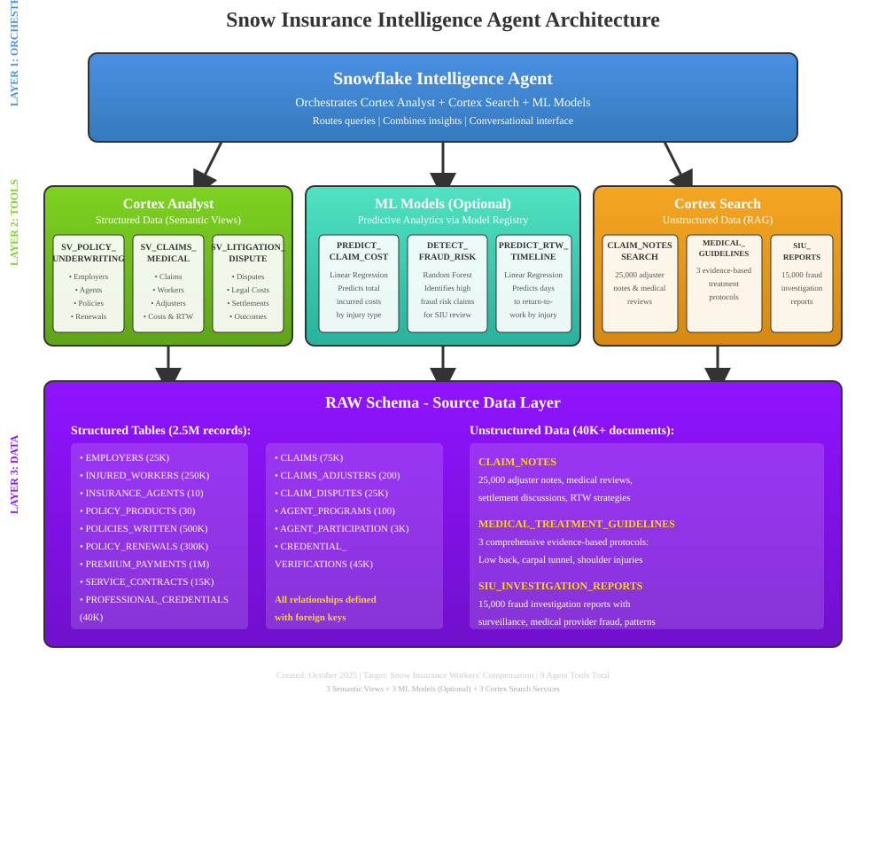

author: StephenDickson1
id: snowflake-intelligence-snow-works-comp-insurance
summary: Build an AI-powered workers' compensation insurance intelligence agent using Snowflake Cortex Intelligence, Cortex Analyst, and Cortex Search
categories: AI-ML,featured,getting-started
environments: web
status: Published
feedback link: https://github.com/Snowflake-Labs/sfguides/issues
tags: Snowflake Intelligence, Cortex Analyst, Cortex Search, Insurance, AI Agent, ML

# Build a Workers' Compensation Insurance Intelligence Agent with Snowflake
<!-- ------------------------ -->
## Overview
Duration: 5

This QuickStart demonstrates how to build a comprehensive AI-powered intelligence agent for workers' compensation insurance using Snowflake's Cortex Intelligence platform. You'll create an agent that analyzes policies, claims, medical management, litigation, fraud detection, and return-to-work programs by combining structured and unstructured data.

### About Snow Insurance Company

Snow Insurance is a leading specialist in workers' compensation insurance, operating across 45 states and the District of Columbia. This solution showcases how Snow can leverage AI to analyze:

- **Policy & Underwriting Intelligence**: New business, renewals, agent performance, competitive wins
- **Claims & Medical Intelligence**: Claim costs, return-to-work rates, medical management, adjuster performance
- **Litigation & Dispute Intelligence**: Disputed claims, legal costs, settlement outcomes, litigation trends
- **Fraud Detection**: SIU investigations, suspicious claim patterns, overbilling analysis
- **Unstructured Data Search**: Semantic search over 25,000 claim notes, medical guidelines, and 15,000 SIU reports

### GitHub Repository

**Repository**: [Snow-Insurance-Demo on GitHub](https://github.com/sfc-gh-sdickson/Snow-Insurance-Demo/)

> **🔗 Repository Link:**  
> [View Complete Source Code on GitHub →](https://github.com/sfc-gh-sdickson/Snow-Insurance-Demo/)

All SQL scripts, notebooks, and documentation for this QuickStart are available in the [GitHub repository](https://github.com/sfc-gh-sdickson/Snow-Insurance-Demo/).

### Prerequisites

- Snowflake account with Cortex Intelligence enabled
- ACCOUNTADMIN or equivalent privileges
- Basic familiarity with SQL and Snowflake
- Understanding of workers' compensation insurance concepts (helpful but not required)

### What You'll Learn

- How to create semantic views for Cortex Analyst
- How to implement Cortex Search services for unstructured data
- How to configure a Snowflake Intelligence Agent
- How to combine structured and unstructured data analysis
- How to test AI agents with complex insurance questions
- (Optional) How to integrate ML models for prediction

### What You'll Need

- A Snowflake account with Cortex Intelligence enabled
- X-SMALL or larger warehouse
- Approximately 45-60 minutes for setup
- Additional 30 minutes for optional ML components

### What You'll Build

By the end of this QuickStart, you'll have built:

- A complete workers' compensation insurance database with 2.5M+ records
- Three semantic views for policy, claims, and litigation intelligence
- Three Cortex Search services for claim notes, medical guidelines, and fraud investigations
- A fully functional Snowflake Intelligence Agent
- (Optional) Three ML models for cost prediction, fraud detection, and RTW forecasting


<!-- ------------------------ -->
## Architecture Overview
Duration: 3

The Snow Insurance Intelligence Agent uses a three-layer architecture:



### Layer 1: Snowflake Intelligence Agent (Orchestration)
- Routes requests to appropriate services
- Combines structured and unstructured insights
- Provides conversational interface

### Layer 2A: Cortex Analyst (Structured Data)
- Analyzes structured data via semantic views
- 3 semantic views covering policy, claims, and litigation
- Provides metrics, aggregations, and trend analysis

### Layer 2B: Cortex Search (Unstructured Data)
- Searches unstructured documents semantically
- 3 search services: Claim notes, treatment guidelines, SIU reports
- Enables RAG (Retrieval Augmented Generation)

### Layer 3: RAW & ANALYTICS Schemas (Source Data)
- 15 structured tables with 2.5M records
- 40K+ unstructured documents
- All relationships defined with foreign keys

### Key Features

✅ **Hybrid Data Architecture**: Combines structured tables with unstructured claim notes and medical content  
✅ **Semantic Search**: Find similar claims and fraud patterns by meaning, not keywords  
✅ **RAG-Ready**: Agent can retrieve context from claim notes and treatment guidelines  
✅ **Production-Ready Syntax**: All SQL verified against Snowflake documentation  
✅ **Comprehensive Demo**: 1M+ premium payments, 75K claims, 25K claim notes  
✅ **ML-Powered** (Optional): 3 ML models for claim cost prediction, fraud detection, and return-to-work forecasting


<!-- ------------------------ -->
## Setup Database and Schema
Duration: 5

Let's start by creating the database, schemas, and warehouse.

### Step 1: Create Database Structure

In Snowsight, open a new SQL worksheet and execute:

```sql
-- Create the database
CREATE DATABASE IF NOT EXISTS SNOW_INSURANCE_INTELLIGENCE;

-- Use the database
USE DATABASE SNOW_INSURANCE_INTELLIGENCE;

-- Create schemas
CREATE SCHEMA IF NOT EXISTS RAW;
CREATE SCHEMA IF NOT EXISTS ANALYTICS;

-- Create a virtual warehouse for query processing
CREATE OR REPLACE WAREHOUSE SNOW_WH WITH
    WAREHOUSE_SIZE = 'X-SMALL'
    AUTO_SUSPEND = 300
    AUTO_RESUME = TRUE
    INITIALLY_SUSPENDED = TRUE
    COMMENT = 'Warehouse for Snow Insurance Intelligence Agent queries';

-- Set the warehouse as active
USE WAREHOUSE SNOW_WH;

-- Display confirmation
SELECT 'Database, schema, and warehouse setup completed successfully' AS STATUS;
```

> aside positive
> 
> **Success!** You've created the foundational database structure. The RAW schema will hold your source tables and unstructured data, while ANALYTICS will contain curated views and semantic models.

### Step 2: Verify Setup

Run this query to verify your database and schemas were created:

```sql
SHOW SCHEMAS IN DATABASE SNOW_INSURANCE_INTELLIGENCE;
SHOW WAREHOUSES LIKE 'SNOW_WH';
```

You should see the RAW and ANALYTICS schemas, and the SNOW_WH warehouse.


<!-- ------------------------ -->
## Create Tables
Duration: 10

Now we'll create the 15 core business tables that represent Snow Insurance's operations.

### Database Schema Overview

The solution includes:

**Policy & Underwriting Tables:**
- EMPLOYERS: Companies purchasing workers' comp insurance
- INSURANCE_AGENTS: Agents and brokers selling policies
- POLICY_PRODUCTS: Coverage products and state programs
- POLICIES_WRITTEN: New policies issued to employers
- POLICY_RENEWALS: Policy renewals and endorsements
- PREMIUM_PAYMENTS: Premium payments and transactions

**Claims & Medical Tables:**
- INJURED_WORKERS: Employees filing workers' comp claims
- CLAIMS: Workers' compensation injury claims
- CLAIMS_ADJUSTERS: Claims adjusters and case managers
- CLAIM_DISPUTES: Disputed claims and litigation cases

**Supporting Tables:**
- SERVICE_CONTRACTS: Premium service agreements
- PROFESSIONAL_CREDENTIALS: Adjuster licenses and certifications
- CREDENTIAL_VERIFICATIONS: License verification records
- AGENT_PROGRAMS: Agent marketing and training programs
- AGENT_PROGRAM_PARTICIPATION: Agent program engagement

### Execute Table Creation Script

> aside negative
> 
> **Download Required:** For brevity, the complete table creation SQL is available in the [GitHub repository](https://github.com/sfc-gh-sdickson/Snow-Insurance-Demo/). You can download and execute the file: `sql/setup/02_create_tables.sql`

**📄 View on GitHub**: [02_create_tables.sql](https://github.com/sfc-gh-sdickson/Snow-Insurance-Demo/blob/main/sql/setup/02_create_tables.sql)  
**⬇️ Download**: [Download Table Creation SQL](https://raw.githubusercontent.com/sfc-gh-sdickson/Snow-Insurance-Demo/main/sql/setup/02_create_tables.sql)

Alternatively, access the complete SQL from your cloned [repository](https://github.com/sfc-gh-sdickson/Snow-Insurance-Demo/) and execute it in Snowsight.

### Verify Tables Created

```sql
USE SCHEMA SNOW_INSURANCE_INTELLIGENCE.RAW;
SHOW TABLES;
```

You should see 15 tables created in the RAW schema.


<!-- ------------------------ -->
## Generate Sample Data
Duration: 20

Now we'll populate the tables with realistic workers' compensation insurance data.

### Data Volumes

The synthetic data generation will create:
- **25,000** employers across various industries
- **250,000** injured workers
- **500,000** policies written
- **300,000** policy renewals
- **1,000,000** premium payment transactions
- **75,000** workers' compensation claims
- **25,000** claim disputes and litigation cases
- **40,000** professional credentials
- **10** major insurance agents/brokers

### Execute Data Generation

> aside positive
> 
> **Note:** This step takes approximately 10-20 minutes depending on your warehouse size.

Execute the data generation script:

```sql
-- Use the appropriate database and schema
USE DATABASE SNOW_INSURANCE_INTELLIGENCE;
USE SCHEMA RAW;
USE WAREHOUSE SNOW_WH;
```

**📄 View on GitHub**: [03_generate_synthetic_data.sql](https://github.com/sfc-gh-sdickson/Snow-Insurance-Demo/blob/main/sql/data/03_generate_synthetic_data.sql)  
**⬇️ Download**: [Download Data Generation SQL](https://raw.githubusercontent.com/sfc-gh-sdickson/Snow-Insurance-Demo/main/sql/data/03_generate_synthetic_data.sql)

### Monitor Progress

You can monitor the data generation progress:

```sql
-- Check row counts as data is generated
SELECT 'EMPLOYERS' as table_name, COUNT(*) as row_count FROM EMPLOYERS
UNION ALL
SELECT 'INJURED_WORKERS', COUNT(*) FROM INJURED_WORKERS
UNION ALL
SELECT 'POLICIES_WRITTEN', COUNT(*) FROM POLICIES_WRITTEN
UNION ALL
SELECT 'CLAIMS', COUNT(*) FROM CLAIMS
UNION ALL
SELECT 'PREMIUM_PAYMENTS', COUNT(*) FROM PREMIUM_PAYMENTS
ORDER BY table_name;
```

> aside negative
> 
> **Wait Time:** This step generates 2.5M+ records with realistic relationships and business logic. Please allow 10-20 minutes for completion.


<!-- ------------------------ -->
## Create Analytical Views
Duration: 5

Next, we'll create curated analytical views that provide 360-degree insights into employers, policies, claims, and disputes.

### Analytical Views Overview

These views join multiple tables to provide comprehensive business intelligence:

- **V_EMPLOYER_360**: Complete employer profile with claims and policies
- **V_INJURED_WORKER_ANALYTICS**: Worker injury history and outcomes
- **V_POLICY_ANALYTICS**: Policy performance and loss ratios
- **V_PRODUCT_PERFORMANCE**: Policy product metrics
- **V_AGENT_PERFORMANCE**: Agent production and retention
- **V_CLAIMS_ANALYTICS**: Detailed claim metrics and outcomes
- **V_CLAIM_DISPUTE_ANALYTICS**: Litigation and dispute tracking
- **V_PREMIUM_PAYMENT_ANALYTICS**: Premium payment patterns
- **V_ADJUSTER_PERFORMANCE**: Adjuster efficiency metrics
- **V_CREDENTIAL_ANALYTICS**: License and certification tracking

### Execute View Creation

```sql
USE SCHEMA SNOW_INSURANCE_INTELLIGENCE.ANALYTICS;
```

**📄 View on GitHub**: [04_create_views.sql](https://github.com/sfc-gh-sdickson/Snow-Insurance-Demo/blob/main/sql/views/04_create_views.sql)  
**⬇️ Download**: [Download Analytical Views SQL](https://raw.githubusercontent.com/sfc-gh-sdickson/Snow-Insurance-Demo/main/sql/views/04_create_views.sql)

Execute the analytical views script from your [cloned repository](https://github.com/sfc-gh-sdickson/Snow-Insurance-Demo/).

### Test a View

```sql
-- Test the employer 360 view
SELECT * FROM V_EMPLOYER_360 LIMIT 10;

-- Test claims analytics
SELECT 
    injury_type,
    COUNT(*) as claim_count,
    AVG(total_incurred) as avg_cost,
    AVG(days_lost) as avg_days_lost
FROM V_CLAIMS_ANALYTICS
GROUP BY injury_type
ORDER BY avg_cost DESC;
```


<!-- ------------------------ -->
## Create Semantic Views
Duration: 8

Semantic views are the key to enabling Cortex Analyst to understand your data. We'll create three semantic views that define relationships, dimensions, and metrics for the AI agent.

### Semantic Views Overview

1. **SV_POLICY_UNDERWRITING_INTELLIGENCE**: Policy, agent, employer, and renewal data
2. **SV_CLAIMS_MEDICAL_INTELLIGENCE**: Claims, medical costs, and return-to-work metrics
3. **SV_LITIGATION_DISPUTE_INTELLIGENCE**: Disputes, litigation, settlements, and legal costs

### Understanding Semantic Views

Semantic views define:
- **TABLES**: Source tables with primary keys
- **RELATIONSHIPS**: Foreign key relationships between tables
- **DIMENSIONS**: Categorical attributes with synonyms for natural language understanding
- **METRICS**: Calculated measures and aggregations
- **COMMENT**: Description for the AI agent

### Execute Semantic View Creation

```sql
USE SCHEMA SNOW_INSURANCE_INTELLIGENCE.ANALYTICS;
```

**📄 View on GitHub**: [05_create_semantic_views.sql](https://github.com/sfc-gh-sdickson/Snow-Insurance-Demo/blob/main/sql/views/05_create_semantic_views.sql)  
**⬇️ Download**: [Download Semantic Views SQL](https://raw.githubusercontent.com/sfc-gh-sdickson/Snow-Insurance-Demo/main/sql/views/05_create_semantic_views.sql)

Execute the semantic views script.

### Verify Semantic Views

```sql
-- Show all semantic views
SHOW SEMANTIC VIEWS IN SCHEMA SNOW_INSURANCE_INTELLIGENCE.ANALYTICS;

-- View the definition of one semantic view
DESCRIBE SEMANTIC VIEW SV_POLICY_UNDERWRITING_INTELLIGENCE;
```

> aside positive
> 
> **Key Point:** Semantic views enable Cortex Analyst to understand your data structure and translate natural language questions into SQL queries automatically.


<!-- ------------------------ -->
## Create Cortex Search Services
Duration: 12

Now we'll create tables for unstructured data and set up Cortex Search services to enable semantic search over claim notes, medical guidelines, and fraud investigation reports.

### Unstructured Data Overview

We'll create:
- **CLAIM_NOTES**: 25,000 adjuster notes and medical records
- **MEDICAL_TREATMENT_GUIDELINES**: 3 comprehensive treatment protocols
- **SIU_INVESTIGATION_REPORTS**: 15,000 fraud investigation reports

### Cortex Search Services

Each search service enables semantic search by meaning rather than exact keyword matching:
- **CLAIM_NOTES_SEARCH**: Find similar injury patterns and treatment approaches
- **MEDICAL_TREATMENT_GUIDELINES_SEARCH**: Retrieve treatment protocols and best practices
- **SIU_INVESTIGATION_REPORTS_SEARCH**: Search fraud patterns and investigation findings

### Execute Cortex Search Setup

```sql
USE SCHEMA SNOW_INSURANCE_INTELLIGENCE.RAW;
USE WAREHOUSE SNOW_WH;
```

**📄 View on GitHub**: [06_create_cortex_search.sql](https://github.com/sfc-gh-sdickson/Snow-Insurance-Demo/blob/main/sql/search/06_create_cortex_search.sql)  
**⬇️ Download**: [Download Cortex Search SQL](https://raw.githubusercontent.com/sfc-gh-sdickson/Snow-Insurance-Demo/main/sql/search/06_create_cortex_search.sql)

Execute the Cortex Search setup script.

> aside positive
> 
> **Wait Time:** This step generates 40,000+ unstructured documents and builds search indexes. Allow 5-10 minutes for completion.

### Test Cortex Search

After the indexes are built, test the search functionality:

```sql
-- Test claim notes search
SELECT PARSE_JSON(
  SNOWFLAKE.CORTEX.SEARCH_PREVIEW(
      'SNOW_INSURANCE_INTELLIGENCE.RAW.CLAIM_NOTES_SEARCH',
      '{"query": "back injury return to work", "limit":5}'
  )
)['results'] as results;

-- Test medical guidelines search
SELECT PARSE_JSON(
  SNOWFLAKE.CORTEX.SEARCH_PREVIEW(
      'SNOW_INSURANCE_INTELLIGENCE.RAW.MEDICAL_TREATMENT_GUIDELINES_SEARCH',
      '{"query": "treatment timeline low back", "limit":3}'
  )
)['results'] as results;

-- Test SIU investigation reports search
SELECT PARSE_JSON(
  SNOWFLAKE.CORTEX.SEARCH_PREVIEW(
      'SNOW_INSURANCE_INTELLIGENCE.RAW.SIU_INVESTIGATION_REPORTS_SEARCH',
      '{"query": "surveillance evidence fraud", "limit":5}'
  )
)['results'] as results;
```

### Verify Search Services

```sql
SHOW CORTEX SEARCH SERVICES IN SCHEMA SNOW_INSURANCE_INTELLIGENCE.RAW;
```

You should see three search services in READY state.


<!-- ------------------------ -->
## Grant Permissions
Duration: 3

Before creating the agent, we need to grant the appropriate permissions.

### Grant Database Roles

Execute these grant statements (replace `<your_role>` with your role name):

```sql
USE ROLE ACCOUNTADMIN;

-- Grant Cortex Analyst user role
GRANT DATABASE ROLE SNOWFLAKE.CORTEX_ANALYST_USER TO ROLE <your_role>;

-- Grant usage on database and schemas
GRANT USAGE ON DATABASE SNOW_INSURANCE_INTELLIGENCE TO ROLE <your_role>;
GRANT USAGE ON SCHEMA SNOW_INSURANCE_INTELLIGENCE.ANALYTICS TO ROLE <your_role>;
GRANT USAGE ON SCHEMA SNOW_INSURANCE_INTELLIGENCE.RAW TO ROLE <your_role>;

-- Grant privileges on semantic views
GRANT REFERENCES, SELECT ON SEMANTIC VIEW SNOW_INSURANCE_INTELLIGENCE.ANALYTICS.SV_POLICY_UNDERWRITING_INTELLIGENCE TO ROLE <your_role>;
GRANT REFERENCES, SELECT ON SEMANTIC VIEW SNOW_INSURANCE_INTELLIGENCE.ANALYTICS.SV_CLAIMS_MEDICAL_INTELLIGENCE TO ROLE <your_role>;
GRANT REFERENCES, SELECT ON SEMANTIC VIEW SNOW_INSURANCE_INTELLIGENCE.ANALYTICS.SV_LITIGATION_DISPUTE_INTELLIGENCE TO ROLE <your_role>;

-- Grant usage on warehouse
GRANT USAGE ON WAREHOUSE SNOW_WH TO ROLE <your_role>;

-- Grant usage on Cortex Search services
GRANT USAGE ON CORTEX SEARCH SERVICE SNOW_INSURANCE_INTELLIGENCE.RAW.CLAIM_NOTES_SEARCH TO ROLE <your_role>;
GRANT USAGE ON CORTEX SEARCH SERVICE SNOW_INSURANCE_INTELLIGENCE.RAW.MEDICAL_TREATMENT_GUIDELINES_SEARCH TO ROLE <your_role>;
GRANT USAGE ON CORTEX SEARCH SERVICE SNOW_INSURANCE_INTELLIGENCE.RAW.SIU_INVESTIGATION_REPORTS_SEARCH TO ROLE <your_role>;
```

> aside positive
> 
> **Tip:** If you're using ACCOUNTADMIN role, you can grant to ACCOUNTADMIN itself for testing purposes.


<!-- ------------------------ -->
## Create Snowflake Intelligence Agent
Duration: 5

Now we'll create the Snowflake Intelligence Agent that orchestrates between Cortex Analyst and Cortex Search.

### Step 1: Navigate to Agents

1. In Snowsight, click on **AI & ML** in the left navigation
2. Click on **Agents**
3. Click **+ Create Agent**
4. Select **Create this agent for Snowflake Intelligence**

### Step 2: Configure Agent Basics

Configure the following:
- **Agent Object Name**: `SNOW_INSURANCE_INTELLIGENCE_AGENT`
- **Display Name**: `Snow Insurance Intelligence Agent`
- **Database**: `SNOW_INSURANCE_INTELLIGENCE`
- **Schema**: `ANALYTICS`
- **Warehouse**: `SNOW_WH`

Click **Create**.

### Step 3: Add Description

Click **Edit** in the agent interface, then add this description:

```
This agent orchestrates between Snow Insurance workers' compensation data for analyzing 
structured metrics using Cortex Analyst (semantic views) and unstructured claim notes, 
medical guidelines, and fraud investigation reports using Cortex Search services.
```

### Step 4: Configure Response Instructions

Click on **Instructions** in the left sidebar and add:

```
You are a specialized analytics assistant for Snow Insurance, a leading workers' compensation 
insurance provider. Your primary objectives are:

For structured data queries (policies, claims, financial metrics, loss ratios):
- Use the Cortex Analyst semantic views for policy underwriting, claims medical intelligence, 
  and litigation dispute analysis
- Provide direct, numerical answers with minimal explanation
- Format responses clearly with relevant units, percentages, and time periods
- Only include essential context needed to understand the metric

For unstructured content (claim notes, medical guidelines, fraud investigations):
- Use Cortex Search services to find similar claims, treatment protocols, and investigation findings
- Extract relevant adjuster notes, return-to-work strategies, and settlement approaches
- Summarize fraud investigation findings and medical treatment recommendations
- Maintain context from original claim notes and investigation reports

Operating guidelines:
- Always identify whether you're using Cortex Analyst or Cortex Search for each response
- Keep responses under 3-4 sentences when possible for metrics
- Present numerical data in structured format
- Don't speculate beyond available data
- Highlight loss ratios, claim frequency, return-to-work rates, and fraud indicators
- For claim analysis, reference specific injury types, body parts, and industries
- Include medical guideline references when discussing treatment appropriateness
```

### Step 5: Add Sample Questions

Add these sample questions to help users get started:
- "Which employers have the highest claim frequency in construction?"
- "What is our competitive win rate against Travelers and Hartford?"
- "Search claim notes for successful return-to-work strategies for back injuries"
- "Show me litigation rates and legal costs by industry"
- "Find SIU reports about surveillance evidence and fraud patterns"

Click **Save**.


<!-- ------------------------ -->
## Add Cortex Analyst Tools
Duration: 8

Now we'll add the three semantic views as Cortex Analyst tools.

### Add Tool 1: Policy & Underwriting Intelligence

1. Click **Tools** in the left sidebar
2. Click **+ Add**
3. Select **Cortex Analyst**
4. **Select semantic view**: `SNOW_INSURANCE_INTELLIGENCE.ANALYTICS.SV_POLICY_UNDERWRITING_INTELLIGENCE`
5. **Add description**:

```
This semantic view contains comprehensive data about employers, insurance agents, policy products, 
policies written, renewals, and professional credentials. Use this for queries about:
- New policy production and competitive wins
- Policy renewal rates and premium changes
- Agent performance and commission analysis
- Employer risk profiles and mod ratings
- Coverage types and state programs
- Professional credentials and licensing
```

6. Click **Save**

### Add Tool 2: Claims & Medical Intelligence

1. Click **+ Add** again
2. Select **Cortex Analyst**
3. **Select semantic view**: `SNOW_INSURANCE_INTELLIGENCE.ANALYTICS.SV_CLAIMS_MEDICAL_INTELLIGENCE`
4. **Add description**:

```
This semantic view contains claims data, injured workers, medical costs, adjusters, and outcomes. 
Use this for queries about:
- Claim costs (medical and indemnity paid)
- Return-to-work rates and lost time days
- Injury types and body part analysis
- Adjuster performance and caseload
- Claim severity and litigation rates
- Industry-specific claim patterns
```

5. Click **Save**

### Add Tool 3: Litigation & Dispute Intelligence

1. Click **+ Add** again
2. Select **Cortex Analyst**
3. **Select semantic view**: `SNOW_INSURANCE_INTELLIGENCE.ANALYTICS.SV_LITIGATION_DISPUTE_INTELLIGENCE`
4. **Add description**:

```
This semantic view contains claim disputes, litigation cases, legal costs, and settlement data. 
Use this for queries about:
- Dispute rates by type and severity
- Legal costs and attorney involvement
- Settlement amounts and outcomes
- Resolution methods (mediation, arbitration, trial)
- Employer-specific litigation patterns
- Dispute resolution timeframes
```

5. Click **Save**

> aside positive
> 
> **Progress Check:** You've now added three Cortex Analyst tools that enable your agent to query structured data using natural language.


<!-- ------------------------ -->
## Add Cortex Search Tools
Duration: 8

Now we'll add the three Cortex Search services for unstructured data search.

### Add Search 1: Claim Notes

1. Click **+ Add** in the Tools section
2. Select **Cortex Search**
3. **Select Cortex Search Service**: `SNOW_INSURANCE_INTELLIGENCE.RAW.CLAIM_NOTES_SEARCH`
4. **Add description**:

```
Search 25,000 claim adjuster notes and medical reviews for return-to-work strategies, 
settlement approaches, and claim management best practices. Use for queries about:
- Successful return-to-work programs and modified duty
- Settlement negotiation strategies and outcomes
- Medical management approaches for specific injuries
- Adjuster handling of complex claims
- Employer cooperation and accommodation
- Claim resolution best practices
```

5. **Configure search settings**:
   - **ID Column**: `note_id`
   - **Title Column**: `claim_id`
   - **Max Results**: 10

6. Click **Save**

### Add Search 2: Medical Treatment Guidelines

1. Click **+ Add**
2. Select **Cortex Search**
3. **Select Cortex Search Service**: `SNOW_INSURANCE_INTELLIGENCE.RAW.MEDICAL_TREATMENT_GUIDELINES_SEARCH`
4. **Add description**:

```
Search evidence-based medical treatment guidelines and protocols for appropriate care pathways. 
Use for queries about:
- ODG-compliant treatment timelines for specific injuries
- Return-to-work restrictions and functional capacity
- Medication management and opioid guidelines
- Physical therapy protocols and exercise programs
- Red flags for serious pathology
- Treatment that exceeds medical necessity
```

5. **Configure search settings**:
   - **ID Column**: `guideline_id`
   - **Title Column**: `title`
   - **Max Results**: 5

6. Click **Save**

### Add Search 3: SIU Investigation Reports

1. Click **+ Add**
2. Select **Cortex Search**
3. **Select Cortex Search Service**: `SNOW_INSURANCE_INTELLIGENCE.RAW.SIU_INVESTIGATION_REPORTS_SEARCH`
4. **Add description**:

```
Search Special Investigation Unit fraud investigation reports for fraud patterns, surveillance 
findings, and investigation techniques. Use for queries about:
- Surveillance evidence and activity inconsistencies
- Medical provider fraud and overbilling patterns
- Staged accidents and false injury claims
- Social media investigation findings
- Pre-existing condition investigations
- Exaggeration of disability indicators
```

5. **Configure search settings**:
   - **ID Column**: `investigation_report_id`
   - **Title Column**: `claim_id`
   - **Max Results**: 10

6. Click **Save**

> aside positive
> 
> **Milestone Achieved:** Your agent now has 6 tools total - 3 Cortex Analyst tools and 3 Cortex Search tools!


<!-- ------------------------ -->
## Test the Agent
Duration: 10

Now let's test the agent with various questions to ensure it works correctly.

### Test Structured Data Queries

Click on **Chat** in the agent interface and try these questions:

#### Test 1: Policy Analysis
```
Which coverage types have the best loss ratios? Show total premium and total claims cost.
```

**Expected**: Agent uses SV_POLICY_UNDERWRITING_INTELLIGENCE with claims data

#### Test 2: Competitive Intelligence
```
Show me our competitive win rate. Which competitors are we winning against most?
```

**Expected**: Agent uses SV_POLICY_UNDERWRITING_INTELLIGENCE, filters competitive_win = TRUE

#### Test 3: Claims Cost Analysis
```
What are the average medical and indemnity costs by injury type?
```

**Expected**: Agent uses SV_CLAIMS_MEDICAL_INTELLIGENCE, groups by injury_type

#### Test 4: Litigation Trends
```
What is our dispute rate by employer industry? Show legal costs by industry vertical.
```

**Expected**: Agent uses SV_LITIGATION_DISPUTE_INTELLIGENCE, aggregates by industry

### Test Unstructured Data Queries

#### Test 5: Claim Notes Search
```
Search claim notes for successful back injury return to work strategies
```

**Expected**: Agent uses CLAIM_NOTES_SEARCH, returns relevant adjuster notes

#### Test 6: Medical Guidelines Search
```
What do our treatment guidelines say about appropriate low back injury treatment timelines?
```

**Expected**: Agent uses MEDICAL_TREATMENT_GUIDELINES_SEARCH, retrieves ODG protocols

#### Test 7: Fraud Investigation Search
```
Find SIU reports about surveillance evidence showing activity inconsistencies
```

**Expected**: Agent uses SIU_INVESTIGATION_REPORTS_SEARCH, returns fraud investigation findings

### Test Combined Queries

#### Test 8: Structured + Unstructured
```
Which injury types have the highest costs? Search treatment guidelines for appropriate care.
```

**Expected**: Agent uses both SV_CLAIMS_MEDICAL_INTELLIGENCE and MEDICAL_TREATMENT_GUIDELINES_SEARCH

> aside positive
> 
> **Success!** If your agent successfully answers these questions, congratulations! Your Snowflake Intelligence Agent is working correctly.


<!-- ------------------------ -->
## Optional: Add ML Models
Duration: 25

This optional section shows how to add machine learning capabilities to your agent for predictive analytics.

### ML Models Overview

You can add three ML models:
1. **CLAIM_COST_PREDICTOR**: Predict total claim costs
2. **FRAUD_DETECTOR**: Identify high fraud risk claims
3. **RTW_TIMELINE_PREDICTOR**: Predict return-to-work timelines

### Step 1: Upload Notebook

1. In Snowsight, click **Projects** → **Notebooks**
2. Click **+ Notebook** → **Import .ipynb file**
3. Upload: `notebooks/snow_ml_models.ipynb` (from your repository)
4. Name it: `Snow ML Models`
5. Configure:
   - **Database**: SNOW_INSURANCE_INTELLIGENCE
   - **Schema**: ANALYTICS
   - **Warehouse**: SNOW_WH
6. Click **Create**

### Step 2: Add Required Packages

1. Click **Packages** dropdown (upper right)
2. Add these packages:
   - `snowflake-ml-python`
   - `scikit-learn`
   - `xgboost`
   - `matplotlib`
3. Click **Start**

### Step 3: Run Notebook

1. Click **Run All**
2. Wait for training to complete (2-3 minutes per model)
3. Verify output shows model registration success

### Step 4: Create Wrapper Procedures

Execute the ML wrapper procedures SQL:

**📄 View on GitHub**: [07_create_model_wrapper_functions.sql](https://github.com/sfc-gh-sdickson/Snow-Insurance-Demo/blob/main/sql/ml/07_create_model_wrapper_functions.sql)  
**⬇️ Download**: [Download ML Wrapper Procedures](https://raw.githubusercontent.com/sfc-gh-sdickson/Snow-Insurance-Demo/main/sql/ml/07_create_model_wrapper_functions.sql)

### Step 5: Add ML Procedures to Agent

In your agent's **Tools** section:

1. Click **+ Add** → **Procedure**
2. Select: `SNOW_INSURANCE_INTELLIGENCE.ANALYTICS.PREDICT_CLAIM_COST`
3. Add description and click **Add**
4. Repeat for `DETECT_FRAUD_RISK` and `PREDICT_RTW_TIMELINE`

### Test ML Capabilities

```
Predict costs for open back injury claims
Which claims have high fraud risk that should be investigated?
Predict return-to-work timeline for shoulder injuries in construction
```

> aside negative
> 
> **Note:** ML models are optional. The core agent functionality works without them.


<!-- ------------------------ -->
## Complex Questions Examples
Duration: 5

Here are 15 sophisticated questions you can ask your agent:

### Policy & Underwriting Questions

1. "Which employers have the highest claim frequency rates by industry vertical?"
2. "What is our competitive win rate against Travelers, Hartford, and Liberty Mutual?"
3. "Show me policy retention rates by agent and identify underperforming agents"
4. "Calculate loss ratios by policy product and state program"
5. "Identify employers at risk of non-renewal based on claim patterns"

### Claims & Medical Questions

6. "Analyze claim costs by injury type - which injuries have longest time to return to work?"
7. "Which employers have the most effective return-to-work programs?"
8. "Show average medical and indemnity costs by body part and industry"
9. "Identify claims with excessive medical costs exceeding $50K"
10. "Analyze claims adjuster performance - show closure rates and costs by adjuster"

### Litigation & Dispute Questions

11. "Show dispute rates and legal costs by dispute type"
12. "Which industries have highest litigation exposure?"
13. "Analyze permanent disability settlement amounts and timelines"

### Unstructured Data Questions

14. "Search claim notes for successful return-to-work strategies in manufacturing"
15. "Find SIU reports about medical provider billing fraud patterns"
16. "What do treatment guidelines say about opioid prescription management?"
17. "Search for settlement negotiation strategies in high-dollar claims"

### Combined Questions

18. "Identify high-cost injury types, then search guidelines for appropriate treatment protocols"
19. "Show employers with high dispute rates, then search SIU reports for fraud patterns"
20. "Find employers with best RTW rates, then search claim notes for their accommodation strategies"


<!-- ------------------------ -->
## Best Practices
Duration: 3

### Agent Design Best Practices

✅ **Clear Instructions**: Provide detailed response instructions so the agent knows when to use each tool

✅ **Tool Descriptions**: Write clear descriptions for each semantic view and search service

✅ **Sample Questions**: Include diverse sample questions to guide users

✅ **Test Thoroughly**: Test with complex questions that require multiple tools

### Data Management Best Practices

✅ **Semantic View Design**: Structure semantic views around business domains (policy, claims, litigation)

✅ **Synonym Management**: Add business-specific synonyms to dimensions for better natural language understanding

✅ **Search Attributes**: Configure filterable attributes in Cortex Search for precise results

✅ **Data Refresh**: Schedule regular updates to keep unstructured content current

### Performance Optimization

✅ **Warehouse Sizing**: Use appropriate warehouse sizes for data generation and queries

✅ **Search Index Management**: Monitor Cortex Search index refresh status

✅ **Query Optimization**: Review Cortex Analyst SQL generation for optimization opportunities

✅ **Result Limits**: Set appropriate max results for search services


<!-- ------------------------ -->
## Troubleshooting
Duration: 3

### Common Issues and Solutions

#### Agent Not Finding Data

**Problem**: Agent returns "no data found" errors

**Solutions**:
- Verify permissions on semantic views and search services
- Check that warehouse is assigned and running
- Ensure semantic views have data (check row counts)
- Confirm search services are in READY state

#### Cortex Search Not Working

**Problem**: Search queries return empty results

**Solutions**:
- Verify change tracking is enabled on tables
- Check that search services have finished indexing
- Allow 5-10 minutes for initial indexing after creation
- Test search services directly using SQL

#### Slow Response Times

**Problem**: Agent takes too long to respond

**Solutions**:
- Increase warehouse size for complex queries
- Verify Cortex Search indexes are built
- Check query complexity in Cortex Analyst
- Review search service target lag settings

#### Permission Errors

**Problem**: "Insufficient privileges" errors

**Solutions**:
- Grant CORTEX_ANALYST_USER database role
- Grant REFERENCES and SELECT on semantic views
- Grant USAGE on Cortex Search services
- Verify warehouse usage permissions

### Getting Help

- Review the [Cortex Intelligence documentation](https://docs.snowflake.com/en/user-guide/snowflake-cortex/cortex-intelligence)
- Check [Cortex Analyst documentation](https://docs.snowflake.com/en/user-guide/snowflake-cortex/cortex-analyst)
- Read [Cortex Search documentation](https://docs.snowflake.com/en/user-guide/snowflake-cortex/cortex-search)
- Contact your Snowflake account team


<!-- ------------------------ -->
## Conclusion and Next Steps
Duration: 3


Congratulations! You've successfully built a comprehensive Snowflake Intelligence Agent for workers' compensation insurance.

### What You've Built

✅ Complete insurance database with 2.5M+ structured records  
✅ 40K+ unstructured documents (claim notes, guidelines, investigations)  
✅ 3 semantic views for structured data analysis  
✅ 3 Cortex Search services for unstructured data search  
✅ Fully functional AI agent combining multiple data sources  
✅ (Optional) 3 ML models for predictive analytics  

### Next Steps

**Expand the Solution:**
- Add more semantic views for specific business areas
- Include additional unstructured content sources
- Create custom ML models for your use cases
- Build dashboards to visualize agent insights

**Integrate with Applications:**
- Use the agent API for custom applications
- Embed agent capabilities in existing workflows
- Create automated reporting using agent queries

**Optimize and Monitor:**
- Track common questions and optimize semantic views
- Monitor agent performance and response times
- Refine instructions based on user feedback
- Schedule regular data refreshes

### What You Learned

- How to design semantic views for Cortex Analyst
- How to implement Cortex Search for unstructured data
- How to configure Snowflake Intelligence Agents
- How to combine structured and unstructured analysis
- How to test AI agents with complex business questions
- How to integrate ML models for predictions

### Related Resources

#### Documentation
- [Snowflake Cortex Intelligence](https://docs.snowflake.com/en/user-guide/snowflake-cortex/cortex-intelligence)
- [Cortex Analyst Guide](https://docs.snowflake.com/en/user-guide/snowflake-cortex/cortex-analyst)
- [Cortex Search Overview](https://docs.snowflake.com/en/user-guide/snowflake-cortex/cortex-search)
- [Semantic Views Reference](https://docs.snowflake.com/en/sql-reference/sql/create-semantic-view)

#### Code Repository

**Repository**: [Snow-Insurance-Demo on GitHub](https://github.com/sfc-gh-sdickson/Snow-Insurance-Demo/)

> **🔗 Repository Link:**  
> [View Complete Source Code on GitHub →](https://github.com/sfc-gh-sdickson/Snow-Insurance-Demo/)

#### Additional QuickStarts
- [Getting Started with Cortex Analyst](https://quickstarts.snowflake.com/)
- [Building AI Applications with Cortex](https://quickstarts.snowflake.com/)
- [Cortex Search for RAG Applications](https://quickstarts.snowflake.com/)

### Share Your Feedback

We'd love to hear about your experience building this solution!

- Submit feedback via the [GitHub Issues](https://github.com/Snowflake-Labs/sfguides/issues)
- Share your success story with your Snowflake account team
- Connect with the Snowflake community

---

**Thank you for completing this QuickStart!** You're now ready to build sophisticated AI-powered intelligence agents for insurance and other industries using Snowflake Cortex Intelligence.
